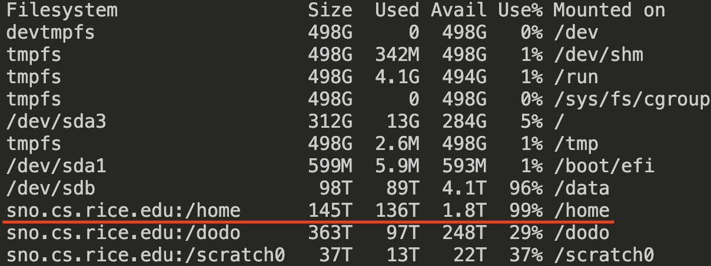
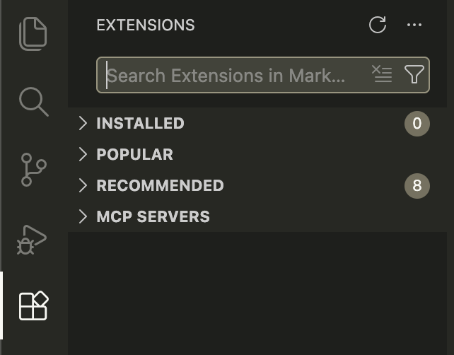
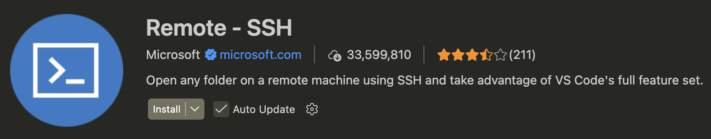
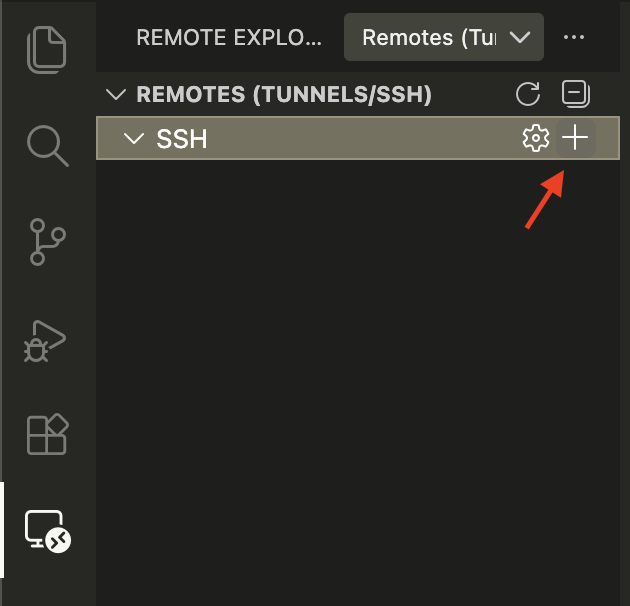
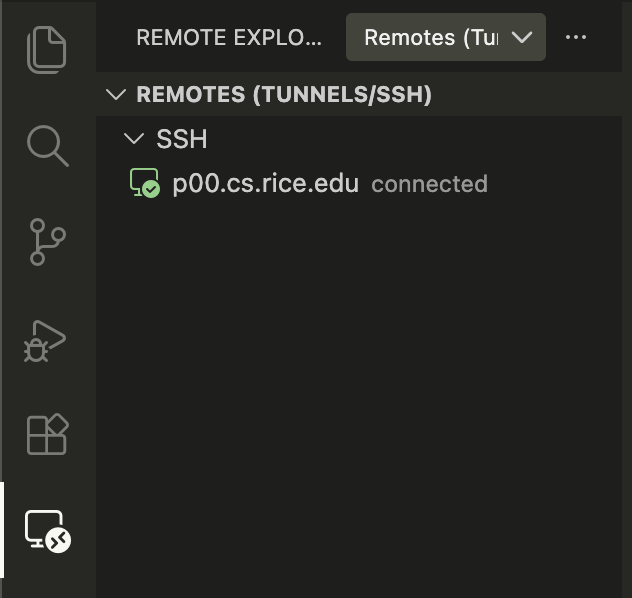
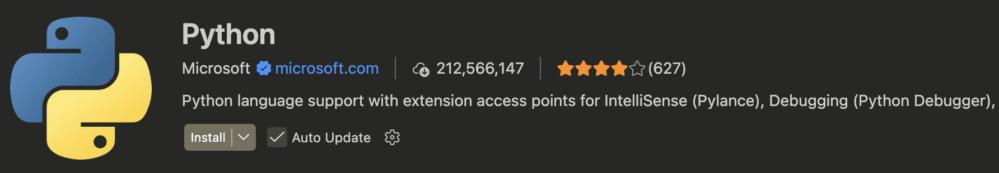
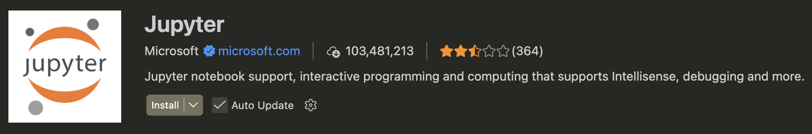
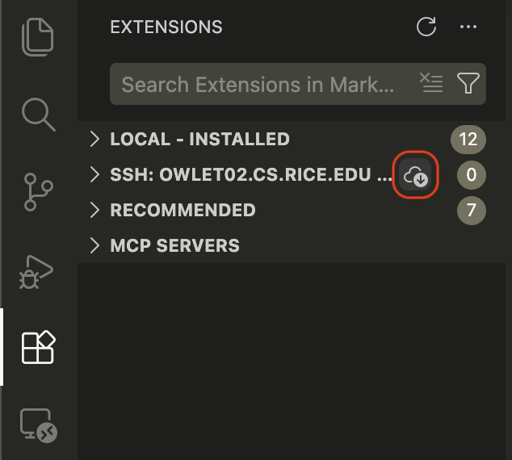

# Stadler Lab Server SOP

## Table of contents

1. [Important: Before starting any job](#important-before-starting-any-job)
2. [Getting access to the server](#getting-access-to-the-server)
3. [Connecting to the server](#connecting-to-the-server)
4. [Setting up Conda](#setting-up-conda)
5. [Setting up Jupyter Notebook in VS Code](#setting-up-jupyter-notebook-in-vs-code)

## Important: Before starting any job
**Check CPU and RAM usage with `htop`**
- p00 has 64 physical CPU cores (not 128 as shown in `htop`) and 996 GB of RAM. If you need to run a job that requires > 32 CPU cores or > 512 GB of RAM, please post a note in the Slack channel first so other users are aware. 

**Check disk usage with `df -h`**
- Your home directory is located on the `/home` partition (`/home/Users/<your-netid>`, e.g., `/home/Users/xw66`). However, it is not recommended to store anything in your home directory, including data, code, databases, etc., unless absolutely necessary. This is because the disk array is old and unstable, and data loss could occur at any time. Ideally, your home directory should only store configuration scripts (e.g., .bashrc) and temporary files (e.g., .bash_history). 
- Use `/dodo` for data storage. Move any data in your home directory into `/dodo/<your-netid>`. If you don’t have access (e.g., it’s not listed in `df -h`), contact Michael for help. 
- Use `/data` to store datasets that need fast disk I/O (e.g., BLAST databases). 

<div style="margin-left: 40px;">
  
</div>

## Getting access to the server
1. Fill out this form and select Dr. Stadler as sponsor (https://www.crc.rice.edu/app/ricelogin.php). 
2. In "Software Requirements or Comments", write:
    ```
    Request access to lab server p00.cs.rice.edu and file system sno.cs.rice.edu:/dodo. 
    ```
3. Once Dr. Stadler has approved the request, Rice IT will add you as a regular user on the server. 

## Connecting to the server

### Via terminal
- In your terminal, type
  ```bash
  ssh <your-netid>@p00.cs.rice.edu
  ```
  For example, `ssh xw66@p00.cs.rice.edu`
- When prompted, type `yes` to continue. 
- Enter your NetID password. If successful, you will be connected to the server at your home directory. 

### Via VS Code (recommended)
VS Code can also connect to the server via SSH and provides a user-friendly IDE for managing files, writing code, and running jobs. 
- Install VS Code from the official website (https://code.visualstudio.com/). 
- (Optional) Link your GitHub account to sync your settings. 
- Click the "Extensions" icon on the left, and search for "ssh". 

<div style="margin-left: 40px;">
  
</div>

- Install the "Remote - SSH" extension. 

<div style="margin-left: 40px;">
  
</div>

- Click the new icon that appears on the left sidebar, called "Remote Explorer". Click the "+" button. 

<div style="margin-left: 40px;">
  
</div>

- In the pop-up text box, enter the SSH command
  ```bash
  ssh <your-netid>@p00.cs.rice.edu
  ```
  For example, `ssh xw66@p00.cs.rice.edu`
- Select the default SSH config file. In the pop-up window in the bottom-right corner, click "Connect". 
- A new VS Code window will open. Select "Continue" and enter your password. 
- In the new window, click the "Remote Explorer" icon on the left, and you should see that you are now connected to the server. 

<div style="margin-left: 40px;">
  
</div>

- In the center of the window, click "Open...". In the pop-up window, navigate to the directory you want to open and click "OK". 
- Drag-and-drop any files to the file explorer on the left to upload them to the server. Right-click a file to download it to your computer. 

## Setting up Conda
**1. Install `conda`**  
Conda is installed with [Miniforge](https://github.com/conda-forge/miniforge). See their [installation guide](https://github.com/conda-forge/miniforge?tab=readme-ov-file#unix-like-platforms-macos-linux--wsl) for Unix-like platforms. 

**2. Set up `conda` channels**
```bash
conda config --remove-key channels
conda config --add channels bioconda
conda config --add channels conda-forge
conda config --set channel_priority strict
```
This will create a `.condarc` file in your home directory. 

**3. Create a conda environment for your project**  
Each project should have its own environment, and you should never use the `base` environment. 
```bash
# replace <myenv> with your project name
# add packages needed for your project
conda create -n <myenv> numpy pandas
```

**4. Activate the conda environment**  
You must activate an environment before using packages installed in it. 
```bash
conda activate <myenv>
```
If successful, the name of the environment will be shown in the shell prompt. For example, 
```
xw66@p00:~$ conda activate seqwin
(seqwin) xw66@p00:~$ 
```

## Setting up Jupyter Notebook in VS Code
**1. Install VS Code extensions on your local machine**  
Before connecting to the server, go to the Extensions tab (left sidebar), search for and install the Python and Jupyter extensions. 

<div style="margin-left: 0px;">
  
</div>
<div style="margin-left: 0px;">
  
</div>

**2. Install VS Code extensions on the server**
- After connecting to the server, go to the Extensions tab again. Click the download button in the second dropdown menu labeled "SSH: ...". 

<div style="margin-left: 40px;">
  
</div>

- In the pop-up window, select all extensions and click "OK". 

**3. Create a notebook file**
- In the VS Code menu, click File > New File... > Jupyter Notebook. 
- In the empty notebook, in the upper-right corner, click Select Kernel > Python Environments, and select one of your conda environments. 
